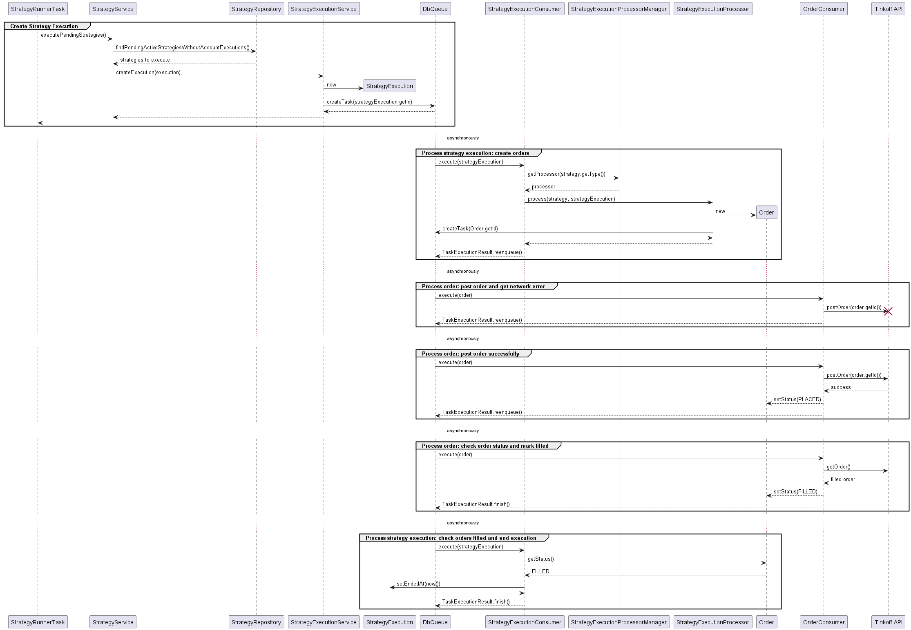

# Tinkoff Invest Robot

It is an application that automatically trades at the Tinkoff broker using
[Tinkoff Invest API](https://github.com/Tinkoff/investAPI).
It supports multiple accounts and multiple strategies per account.

## Strategies

Robot uses strategies to trade. A strategy can be configured with the next parameters:

* `tinkoffAccountId`: id of the account to trade;
* `sandbox`: flag is the account real or at the sandbox;
* `type`: type of strategy (see supported types below);
* `executionPeriod`: how often the strategy will be executed;
* `instruments`: array of instrument (FIGI) to use in strategy.

Each strategy is periodically executed. During its execution it may create some orders
to buy or to sell securities according to its logic.

Current implementation supports the next strategies:

* `INVEST_FREE_CASH_EQUAL_WEIGHTED`
* `REBALANCE_EQUAL_WEIGHTED`

### INVEST_FREE_CASH_EQUAL_WEIGHTED strategy

This is an investing strategy that periodically checks if there is a free cash at the account and
uses this free cash to buy the specified securities using the Equal-Weighted approach. This strategy
does not sell anything and only invests free cash that can be added using recurrent auto-replenishment
feature of Tinkoff broker. It is expected that this strategy is run on a regular basis, e.g. daily, weekly or monthly.

### REBALANCE_EQUAL_WEIGHTED strategy

This strategy sells and buys securities to make the portfolio of securities equally weighted.
It is expected that this strategy is run on a regular basis but rarely, e.g. quarterly or less frequently.

## Executions and orders

Robot creates a strategy execution (`StrategyExecution`) when it understands that the strategy must be executed
according to its `executionPeriod` parameter. The strategy execution may create one or more orders according
to the strategy logic. A strategy execution processor tracks the progress of the execution and the status of orders,
and finally ends the execution.

## Build and Run

### Recommended start

The application is expected to run with a standalone PostgreSQL server. The next environment variables
are required for the application:

* `POSTGRES_HOST`: PostgreSQL server hostname
* `POSTGRES_PORT`: PostgreSQL server port
* `POSTGRES_DBNAME`: database name in PostgreSQL server
* `POSTGRES_USERNAME`: user name in PostgreSQL server
* `POSTGRES_PASSWORD`: user password in PostgreSQL server
* `TINKOFF_CLIENT_TOKEN`: required if interaction with real accounts is expected
* `TINKOFF_CLIENT_SANDBOX_TOKEN`: required if interaction with sandbox accounts is expected
* `TINKOFF_CLIENT_APP_NAME`: optional, to distinguish API requests

The command to run the application:
```
.mvnw spring-boot:run
```

### [Tinkoff Contest Case] Start with inmemory database using testcontainers

This application was developed for [Tinkoff Invest Robot Contest](https://github.com/Tinkoff/invest-robot-contest).
One of the requirements was to run the application without extra applications.
So it is possible to run the application without standalone PostgreSQL server.
To run the application with PostgreSQL server running in Docker
(using [testcontainers](https://github.com/testcontainers)) only
the next environment variables must be set:
* `TINKOFF_CLIENT_TOKEN`: required if interaction with real accounts is expected
* `TINKOFF_CLIENT_SANDBOX_TOKEN`: required if interaction with sandbox accounts is expected
* `TINKOFF_CLIENT_APP_NAME`: optional, to distinguish API requests

The command to run the application:
```
.mvnw spring-boot:run -D"spring-boot.run.profiles"=inmemory
```

Pay attention that no data is saved between restarts of the application in this mode.

## REST API

REST API allows to configure the robot and to get details about its operation. REST clients can be used
to visualize results of strategies: print strategy executions and created orders with their statuses
(see [Testing](#Testing) section below for details and demonstration).

OpenAPI 3 specification docs are available at the path `/v3/api-docs/` (http://localhost:8080/v3/api-docs/).

Swagger UI is available at the path `/swagger-ui.html` (http://localhost:8080/swagger-ui.html).

## Testing

This section presents the usage of the robot with a real account. For testing purposes the `executionPeriod`
is set to 10 minutes. Let's create the first strategy of `INVEST_FREE_CASH_EQUAL_WEIGHTED` type:
<details>
<summary>curl -X POST 'localhost:8080/api/v1/strategies'</summary>

```
curl -X POST 'localhost:8080/api/v1/strategies' \
--header 'Content-Type: application/json' \
--data-raw '{
  "tinkoffAccountId": "2172037018",
  "sandbox": false,
  "type": "INVEST_FREE_CASH_EQUAL_WEIGHTED",
  "executionPeriod": "PT10M",
  "instruments": [
      "BBG004731354",
      "BBG004S682Z6",
      "BBG004730JJ5"
  ]
}'
{
    "id": "fe003d61-d044-42e1-8e89-d2785b690ea2",
    "createdAt": "2022-05-16T11:38:49.429706100Z",
    "updatedAt": "2022-05-16T11:38:49.429706100Z",
    "status": "ACTIVE",
    "tinkoffAccountId": "2172037018",
    "sandbox": false,
    "type": "INVEST_FREE_CASH_EQUAL_WEIGHTED",
    "executionPeriod": "PT10M",
    "instruments": [
        "BBG004731354",
        "BBG004S682Z6",
        "BBG004730JJ5"
    ]
}
```
</details>

Its executions:
<details>
<summary>curl -X GET 'localhost:8080/api/v1/strategies/fe003d61-d044-42e1-8e89-d2785b690ea2/executions?sort=startedAt,desc'</summary>

```
curl -X GET 'localhost:8080/api/v1/strategies/fe003d61-d044-42e1-8e89-d2785b690ea2/executions?sort=startedAt,desc'
{
    "content": [
        {
            "id": "456a9ba0-7c12-4a35-8f58-c346459cfe0f",
            "createdAt": "2022-05-16T11:39:30.892874Z",
            "updatedAt": "2022-05-16T11:39:40.674410Z",
            "strategyId": "fe003d61-d044-42e1-8e89-d2785b690ea2",
            "tinkoffAccountId": "2172037018",
            "sandbox": false,
            "startedAt": "2022-05-16T11:39:30.883880Z",
            "endedAt": "2022-05-16T11:39:40.657627Z",
            "orders": []
        }
    ],
    "pageable": {
        "sort": {
            "empty": false,
            "sorted": true,
            "unsorted": false
        },
        "offset": 0,
        "pageSize": 20,
        "pageNumber": 0,
        "unpaged": false,
        "paged": true
    },
    "last": true,
    "totalElements": 1,
    "totalPages": 1,
    "size": 20,
    "number": 0,
    "sort": {
        "empty": false,
        "sorted": true,
        "unsorted": false
    },
    "first": true,
    "numberOfElements": 1,
    "empty": false
}
```
</details>

Now we can add money to account and wait for the next execution.

<details>
<summary>The log contains:</summary>

```
2022-05-16 14:50:31.061  INFO 23676 --- [   scheduling-1] i.t.service.StrategyService              : Created execution for strategy: strategyId=fe003d61-d044-42e1-8e89-d2785b690ea2, executionId=d1dc1822-f1ba-49b0-8ad1-02d531f7aab4.
2022-05-16 14:50:31.061  INFO 23676 --- [   scheduling-1] i.t.scheduling.StrategyRunnerTask        : StrategyRunnerTask executed in 0 millis.
2022-05-16 14:50:32.349  INFO 23676 --- [        queue-1] r.y.t.d.c.i.LoggingTaskLifecycleListener : consuming task: id=2, attempt=1
2022-05-16 14:50:32.349  INFO 23676 --- [        queue-1] i.t.service.StrategyService              : Executing strategy: strategyId=fe003d61-d044-42e1-8e89-d2785b690ea2, executionId=d1dc1822-f1ba-49b0-8ad1-02d531f7aab4...
2022-05-16 14:50:32.697  INFO 23676 --- [        queue-1] t.s.s.EqualWeightedAlgorithmOrderCreator : Creating buy orders for strategy execution: id=d1dc1822-f1ba-49b0-8ad1-02d531f7aab4, money=3000.000000000, pricedPositions=[PricedPosition{instrument=BBG004731354, quantity=0, price=381.850000000}, PricedPosition{instrument=BBG004S682Z6, quantity=0, price=58.590000000}, PricedPosition{instrument=BBG004730JJ5, quantity=0, price=89.650000000}], totalValue=3000.000000000, targetPositionValue=1000.000000000
2022-05-16 14:50:32.697  INFO 23676 --- [        queue-1] hEqualWeightedStrategyExecutionProcessor : Generated orders for strategy execution: id=d1dc1822-f1ba-49b0-8ad1-02d531f7aab4, orders=[Order(tinkoffAccountId=2172037018, sandbox=false, figi=BBG004731354, lots=2, direction=BUY, status=NEW, placeAt=null, tinkoffOrderId=null, strategyExecutionId=d1dc1822-f1ba-49b0-8ad1-02d531f7aab4), Order(tinkoffAccountId=2172037018, sandbox=false, figi=BBG004S682Z6, lots=1, direction=BUY, status=NEW, placeAt=null, tinkoffOrderId=null, strategyExecutionId=d1dc1822-f1ba-49b0-8ad1-02d531f7aab4), Order(tinkoffAccountId=2172037018, sandbox=false, figi=BBG004730JJ5, lots=1, direction=BUY, status=NEW, placeAt=null, tinkoffOrderId=null, strategyExecutionId=d1dc1822-f1ba-49b0-8ad1-02d531f7aab4)]
2022-05-16 14:50:32.750  INFO 23676 --- [        queue-1] i.t.service.StrategyService              : Executed strategy: strategyId=fe003d61-d044-42e1-8e89-d2785b690ea2, executionId=d1dc1822-f1ba-49b0-8ad1-02d531f7aab4, result=RESCHEDULE.
2022-05-16 14:50:32.750  INFO 23676 --- [        queue-1] r.y.t.d.c.i.LoggingTaskLifecycleListener : task reenqueued: id=2, delay=PT1M, time=401
2022-05-16 14:50:40.918  INFO 23676 --- [        queue-0] r.y.t.d.c.i.LoggingTaskLifecycleListener : consuming task: id=5, attempt=1
2022-05-16 14:50:41.204  INFO 23676 --- [        queue-0] i.t.service.OrderService                 : Got order response: tinkoffOrderStatus=EXECUTION_REPORT_STATUS_FILL, orderId=57c2a824-03ac-4bf7-950b-7ff58ac624f0, tinkoffOrderId=31307058406
2022-05-16 14:50:41.206  INFO 23676 --- [        queue-0] i.t.service.OrderService                 : Placed order: Order(tinkoffAccountId=2172037018, sandbox=false, figi=BBG004730JJ5, lots=1, direction=BUY, status=FILLED, placeAt=null, tinkoffOrderId=31307058406, strategyExecutionId=d1dc1822-f1ba-49b0-8ad1-02d531f7aab4)
2022-05-16 14:50:41.222  INFO 23676 --- [        queue-0] r.y.t.d.c.i.LoggingTaskLifecycleListener : task finished: id=5, in-queue=PT8.4710567S, time=302
2022-05-16 14:50:42.237  INFO 23676 --- [        queue-0] r.y.t.d.c.i.LoggingTaskLifecycleListener : consuming task: id=4, attempt=1
2022-05-16 14:50:42.442  INFO 23676 --- [        queue-0] i.t.service.OrderService                 : Got order response: tinkoffOrderStatus=EXECUTION_REPORT_STATUS_FILL, orderId=6e129a3b-20fb-402c-8de2-46eb0490a8f6, tinkoffOrderId=31307058734
2022-05-16 14:50:42.443  INFO 23676 --- [        queue-0] i.t.service.OrderService                 : Placed order: Order(tinkoffAccountId=2172037018, sandbox=false, figi=BBG004S682Z6, lots=1, direction=BUY, status=FILLED, placeAt=null, tinkoffOrderId=31307058734, strategyExecutionId=d1dc1822-f1ba-49b0-8ad1-02d531f7aab4)
2022-05-16 14:50:42.456  INFO 23676 --- [        queue-0] r.y.t.d.c.i.LoggingTaskLifecycleListener : task finished: id=4, in-queue=PT9.7065805S, time=219
2022-05-16 14:50:43.482  INFO 23676 --- [        queue-0] r.y.t.d.c.i.LoggingTaskLifecycleListener : consuming task: id=3, attempt=1
2022-05-16 14:50:43.808  INFO 23676 --- [        queue-0] i.t.service.OrderService                 : Got order response: tinkoffOrderStatus=EXECUTION_REPORT_STATUS_FILL, orderId=943928cb-8e8a-4d66-809b-b56cd7abc28c, tinkoffOrderId=R45530491
2022-05-16 14:50:43.808  INFO 23676 --- [        queue-0] i.t.service.OrderService                 : Placed order: Order(tinkoffAccountId=2172037018, sandbox=false, figi=BBG004731354, lots=2, direction=BUY, status=FILLED, placeAt=null, tinkoffOrderId=R45530491, strategyExecutionId=d1dc1822-f1ba-49b0-8ad1-02d531f7aab4)
2022-05-16 14:50:43.817  INFO 23676 --- [        queue-0] r.y.t.d.c.i.LoggingTaskLifecycleListener : task finished: id=3, in-queue=PT11.0674572S, time=334
2022-05-16 14:51:31.081  INFO 23676 --- [   scheduling-1] i.t.scheduling.StrategyRunnerTask        : StrategyRunnerTask executed in 4 millis.
2022-05-16 14:51:33.833  INFO 23676 --- [        queue-1] r.y.t.d.c.i.LoggingTaskLifecycleListener : consuming task: id=2, attempt=1
2022-05-16 14:51:33.840  INFO 23676 --- [        queue-1] i.t.service.StrategyService              : Executing strategy: strategyId=fe003d61-d044-42e1-8e89-d2785b690ea2, executionId=d1dc1822-f1ba-49b0-8ad1-02d531f7aab4...
2022-05-16 14:51:33.844  INFO 23676 --- [        queue-1] hEqualWeightedStrategyExecutionProcessor : Completing strategy execution with orders in final state: strategyExecutionId=d1dc1822-f1ba-49b0-8ad1-02d531f7aab4, orders=[Order(tinkoffAccountId=2172037018, sandbox=false, figi=BBG004731354, lots=2, direction=BUY, status=FILLED, placeAt=null, tinkoffOrderId=R45530491, strategyExecutionId=d1dc1822-f1ba-49b0-8ad1-02d531f7aab4), Order(tinkoffAccountId=2172037018, sandbox=false, figi=BBG004S682Z6, lots=1, direction=BUY, status=FILLED, placeAt=null, tinkoffOrderId=31307058734, strategyExecutionId=d1dc1822-f1ba-49b0-8ad1-02d531f7aab4), Order(tinkoffAccountId=2172037018, sandbox=false, figi=BBG004730JJ5, lots=1, direction=BUY, status=FILLED, placeAt=null, tinkoffOrderId=31307058406, strategyExecutionId=d1dc1822-f1ba-49b0-8ad1-02d531f7aab4)].
2022-05-16 14:51:33.851  INFO 23676 --- [        queue-1] i.t.service.StrategyService              : Executed strategy: strategyId=fe003d61-d044-42e1-8e89-d2785b690ea2, executionId=d1dc1822-f1ba-49b0-8ad1-02d531f7aab4, result=COMPLETE.
2022-05-16 14:51:33.852  INFO 23676 --- [        queue-1] r.y.t.d.c.i.LoggingTaskLifecycleListener : task finished: id=2, in-queue=PT1M2.7862411S, time=19
```
</details>

And the executions are:
<details>
<summary>curl -X GET 'localhost:8080/api/v1/strategies/fe003d61-d044-42e1-8e89-d2785b690ea2/executions?sort=startedAt,desc'</summary>

```
curl -X GET 'localhost:8080/api/v1/strategies/fe003d61-d044-42e1-8e89-d2785b690ea2/executions?sort=startedAt,desc'
{
    "content": [
        {
            "id": "d1dc1822-f1ba-49b0-8ad1-02d531f7aab4",
            "createdAt": "2022-05-16T11:50:31.061225Z",
            "updatedAt": "2022-05-16T11:50:31.061225Z",
            "strategyId": "fe003d61-d044-42e1-8e89-d2785b690ea2",
            "tinkoffAccountId": "2172037018",
            "sandbox": false,
            "startedAt": "2022-05-16T11:50:31.061225Z",
            "endedAt": null,
            "orders": [
                {
                    "id": "943928cb-8e8a-4d66-809b-b56cd7abc28c",
                    "createdAt": "2022-05-16T11:50:32.744452Z",
                    "updatedAt": "2022-05-16T11:50:43.811771Z",
                    "figi": "BBG004731354",
                    "lots": 2,
                    "direction": "BUY",
                    "status": "FILLED",
                    "placeAt": null,
                    "tinkoffOrderId": "R45530491"
                },
                {
                    "id": "6e129a3b-20fb-402c-8de2-46eb0490a8f6",
                    "createdAt": "2022-05-16T11:50:32.744452Z",
                    "updatedAt": "2022-05-16T11:50:42.448490Z",
                    "figi": "BBG004S682Z6",
                    "lots": 1,
                    "direction": "BUY",
                    "status": "FILLED",
                    "placeAt": null,
                    "tinkoffOrderId": "31307058734"
                },
                {
                    "id": "57c2a824-03ac-4bf7-950b-7ff58ac624f0",
                    "createdAt": "2022-05-16T11:50:32.744452Z",
                    "updatedAt": "2022-05-16T11:50:41.214370Z",
                    "figi": "BBG004730JJ5",
                    "lots": 1,
                    "direction": "BUY",
                    "status": "FILLED",
                    "placeAt": null,
                    "tinkoffOrderId": "31307058406"
                }
            ]
        },
        {
            "id": "456a9ba0-7c12-4a35-8f58-c346459cfe0f",
            "createdAt": "2022-05-16T11:39:30.892874Z",
            "updatedAt": "2022-05-16T11:39:40.674410Z",
            "strategyId": "fe003d61-d044-42e1-8e89-d2785b690ea2",
            "tinkoffAccountId": "2172037018",
            "sandbox": false,
            "startedAt": "2022-05-16T11:39:30.883880Z",
            "endedAt": "2022-05-16T11:39:40.657627Z",
            "orders": []
        }
    ],
    "pageable": {
        "sort": {
            "empty": false,
            "sorted": true,
            "unsorted": false
        },
        "offset": 0,
        "pageSize": 20,
        "pageNumber": 0,
        "unpaged": false,
        "paged": true
    },
    "last": true,
    "totalElements": 2,
    "totalPages": 1,
    "size": 20,
    "number": 0,
    "sort": {
        "empty": false,
        "sorted": true,
        "unsorted": false
    },
    "first": true,
    "numberOfElements": 2,
    "empty": false
}
```
</details>

If the orders are not filled immediately then the service checks periodically the status of orders
until they are filled. Since all orders are in final status (`FILLED`) the executions is ended (`endedAt` is not null).

Let's add more money and check that robot buys more securities.
The executions:

<details>
<summary>curl -X GET 'localhost:8080/api/v1/strategies/fe003d61-d044-42e1-8e89-d2785b690ea2/executions?sort=startedAt,desc'</summary>

```
curl -X GET 'localhost:8080/api/v1/strategies/fe003d61-d044-42e1-8e89-d2785b690ea2/executions?sort=startedAt,desc'
{
    "content": [
        {
            "id": "f8d79621-55e3-4491-920e-6b08c6bc7782",
            "createdAt": "2022-05-16T12:02:31.200304Z",
            "updatedAt": "2022-05-16T12:03:37.064220Z",
            "strategyId": "fe003d61-d044-42e1-8e89-d2785b690ea2",
            "tinkoffAccountId": "2172037018",
            "sandbox": false,
            "startedAt": "2022-05-16T12:02:31.199323Z",
            "endedAt": "2022-05-16T12:03:37.058262Z",
            "orders": [
                {
                    "id": "9c538b90-be1b-4804-890e-d5c9596f1e5e",
                    "createdAt": "2022-05-16T12:02:35.955774Z",
                    "updatedAt": "2022-05-16T12:02:48.544525Z",
                    "figi": "BBG004S682Z6",
                    "lots": 2,
                    "direction": "BUY",
                    "status": "FILLED",
                    "placeAt": null,
                    "tinkoffOrderId": "31307290757"
                },
                {
                    "id": "1eecd375-4d60-4797-b1e2-e2ff8c4537f4",
                    "createdAt": "2022-05-16T12:02:35.955774Z",
                    "updatedAt": "2022-05-16T12:02:47.257043Z",
                    "figi": "BBG004731354",
                    "lots": 3,
                    "direction": "BUY",
                    "status": "FILLED",
                    "placeAt": null,
                    "tinkoffOrderId": "R45534160"
                },
                {
                    "id": "b33e7226-3d4c-4fe6-8222-783f9defa4a1",
                    "createdAt": "2022-05-16T12:02:35.955774Z",
                    "updatedAt": "2022-05-16T12:02:45.819228Z",
                    "figi": "BBG004730JJ5",
                    "lots": 1,
                    "direction": "BUY",
                    "status": "FILLED",
                    "placeAt": null,
                    "tinkoffOrderId": "31307290041"
                }
            ]
        },
        {
            "id": "d1dc1822-f1ba-49b0-8ad1-02d531f7aab4",
            "createdAt": "2022-05-16T11:50:31.061225Z",
            "updatedAt": "2022-05-16T11:51:33.849750Z",
            "strategyId": "fe003d61-d044-42e1-8e89-d2785b690ea2",
            "tinkoffAccountId": "2172037018",
            "sandbox": false,
            "startedAt": "2022-05-16T11:50:31.061225Z",
            "endedAt": "2022-05-16T11:51:33.844753Z",
            "orders": [
                {
                    "id": "943928cb-8e8a-4d66-809b-b56cd7abc28c",
                    "createdAt": "2022-05-16T11:50:32.744452Z",
                    "updatedAt": "2022-05-16T11:50:43.811771Z",
                    "figi": "BBG004731354",
                    "lots": 2,
                    "direction": "BUY",
                    "status": "FILLED",
                    "placeAt": null,
                    "tinkoffOrderId": "R45530491"
                },
                {
                    "id": "6e129a3b-20fb-402c-8de2-46eb0490a8f6",
                    "createdAt": "2022-05-16T11:50:32.744452Z",
                    "updatedAt": "2022-05-16T11:50:42.448490Z",
                    "figi": "BBG004S682Z6",
                    "lots": 1,
                    "direction": "BUY",
                    "status": "FILLED",
                    "placeAt": null,
                    "tinkoffOrderId": "31307058734"
                },
                {
                    "id": "57c2a824-03ac-4bf7-950b-7ff58ac624f0",
                    "createdAt": "2022-05-16T11:50:32.744452Z",
                    "updatedAt": "2022-05-16T11:50:41.214370Z",
                    "figi": "BBG004730JJ5",
                    "lots": 1,
                    "direction": "BUY",
                    "status": "FILLED",
                    "placeAt": null,
                    "tinkoffOrderId": "31307058406"
                }
            ]
        },
        {
            "id": "456a9ba0-7c12-4a35-8f58-c346459cfe0f",
            "createdAt": "2022-05-16T11:39:30.892874Z",
            "updatedAt": "2022-05-16T11:39:40.674410Z",
            "strategyId": "fe003d61-d044-42e1-8e89-d2785b690ea2",
            "tinkoffAccountId": "2172037018",
            "sandbox": false,
            "startedAt": "2022-05-16T11:39:30.883880Z",
            "endedAt": "2022-05-16T11:39:40.657627Z",
            "orders": []
        }
    ],
    "pageable": {
        "sort": {
            "empty": false,
            "sorted": true,
            "unsorted": false
        },
        "offset": 0,
        "pageSize": 20,
        "pageNumber": 0,
        "unpaged": false,
        "paged": true
    },
    "last": true,
    "totalElements": 3,
    "totalPages": 1,
    "size": 20,
    "number": 0,
    "sort": {
        "empty": false,
        "sorted": true,
        "unsorted": false
    },
    "first": true,
    "numberOfElements": 3,
    "empty": false
}
```
</details>

Let's archive (stop) the first strategy, so it does not affect the testing of the next strategy (Actually,
multiple strategies can be active on a single account. There is an internal constraint that verifies that exactly
one execution is active on a single account at any moment so that strategies do not affect each other).
The REST API call:

<details>
<summary>curl -X POST 'localhost:8080/api/v1/strategies/fe003d61-d044-42e1-8e89-d2785b690ea2/archive'</summary>

```
curl -X POST 'localhost:8080/api/v1/strategies/fe003d61-d044-42e1-8e89-d2785b690ea2/archive' \
--data-raw ''
{
    "id": "fe003d61-d044-42e1-8e89-d2785b690ea2",
    "createdAt": "2022-05-16T11:38:49.429706Z",
    "updatedAt": "2022-05-16T12:07:25.966058800Z",
    "status": "ARCHIVED",
    "tinkoffAccountId": "2172037018",
    "sandbox": false,
    "type": "INVEST_FREE_CASH_EQUAL_WEIGHTED",
    "executionPeriod": "PT10M",
    "instruments": [
        "BBG004731354",
        "BBG004S682Z6",
        "BBG004730JJ5"
    ]
}
```
</details>

Now let's create the second strategy of `REBALANCE_EQUAL_WEIGHTED` type:

<details>
<summary>curl --location --request POST 'localhost:8080/api/v1/strategies'</summary>

```
curl -X POST 'localhost:8080/api/v1/strategies' \
--header 'Content-Type: application/json' \
--data-raw '{
  "tinkoffAccountId": "2172037018",
  "sandbox": false,
  "type": "REBALANCE_EQUAL_WEIGHTED",
  "executionPeriod": "PT10M",
  "instruments": [
      "BBG004731354",
      "BBG004S682Z6",
      "BBG004730JJ5"
  ]
}'
{
    "id": "f0a1e130-d7b6-4496-87b5-33dfe76c9b92",
    "createdAt": "2022-05-16T12:08:38.950774600Z",
    "updatedAt": "2022-05-16T12:08:38.950774600Z",
    "status": "ACTIVE",
    "tinkoffAccountId": "2172037018",
    "sandbox": false,
    "type": "REBALANCE_EQUAL_WEIGHTED",
    "executionPeriod": "PT10M",
    "instruments": [
        "BBG004731354",
        "BBG004S682Z6",
        "BBG004730JJ5"
    ]
}
```
</details>

It was executed without orders since our account is balanced due to prices not changed seriously:

<details>
<summary>Log</summary>

```
2022-05-16 15:09:19.701  INFO 22928 --- [   scheduling-1] i.t.service.StrategyService              : Created execution for strategy: strategyId=f0a1e130-d7b6-4496-87b5-33dfe76c9b92, executionId=fa827ec9-3b01-4b88-85a5-9bc206032b7a.
2022-05-16 15:09:19.702  INFO 22928 --- [   scheduling-1] i.t.scheduling.StrategyRunnerTask        : StrategyRunnerTask executed in 53 millis.
2022-05-16 15:09:29.044  INFO 22928 --- [        queue-1] r.y.t.d.c.i.LoggingTaskLifecycleListener : consuming task: id=10, attempt=1
2022-05-16 15:09:29.062  INFO 22928 --- [        queue-1] i.t.service.StrategyService              : Executing strategy: strategyId=f0a1e130-d7b6-4496-87b5-33dfe76c9b92, executionId=fa827ec9-3b01-4b88-85a5-9bc206032b7a...
2022-05-16 15:09:29.641  INFO 22928 --- [        queue-1] t.s.s.EqualWeightedAlgorithmOrderCreator : Creating sell orders for strategy execution: id=fa827ec9-3b01-4b88-85a5-9bc206032b7a, money=535.010000000, pricedPositions=[PricedPosition{instrument=BBG004731354, quantity=5, price=382.400000000}, PricedPosition{instrument=BBG004S682Z6, quantity=30, price=58.630000000}, PricedPosition{instrument=BBG004730JJ5, quantity=20, price=89.700000000}], totalValue=5999.910000000, targetPositionValue=1999.970000000
2022-05-16 15:09:29.849  INFO 22928 --- [        queue-1] t.s.s.EqualWeightedAlgorithmOrderCreator : Creating buy orders for strategy execution: id=fa827ec9-3b01-4b88-85a5-9bc206032b7a, money=535.010000000, pricedPositions=[PricedPosition{instrument=BBG004731354, quantity=5, price=382.400000000}, PricedPosition{instrument=BBG004S682Z6, quantity=30, price=58.630000000}, PricedPosition{instrument=BBG004730JJ5, quantity=20, price=89.700000000}], totalValue=5999.910000000, targetPositionValue=1999.970000000
2022-05-16 15:09:29.898  INFO 22928 --- [        queue-1] i.t.service.StrategyService              : Executed strategy: strategyId=f0a1e130-d7b6-4496-87b5-33dfe76c9b92, executionId=fa827ec9-3b01-4b88-85a5-9bc206032b7a, result=COMPLETE.
2022-05-16 15:09:29.900  INFO 22928 --- [        queue-1] r.y.t.d.c.i.LoggingTaskLifecycleListener : task finished: id=10, in-queue=PT10.2102377S, time=855
```
</details>

The executions:

<details>
<summary>curl -X GET 'localhost:8080/api/v1/strategies/f0a1e130-d7b6-4496-87b5-33dfe76c9b92/executions?sort=startedAt,desc&from=2022-05-16T07:00:00Z'</summary>

```
curl -X GET 'localhost:8080/api/v1/strategies/f0a1e130-d7b6-4496-87b5-33dfe76c9b92/executions?sort=startedAt,desc&from=2022-05-16T07:00:00Z'
{
    "content": [
        {
            "id": "fa827ec9-3b01-4b88-85a5-9bc206032b7a",
            "createdAt": "2022-05-16T12:09:19.681219Z",
            "updatedAt": "2022-05-16T12:09:29.888835Z",
            "strategyId": "f0a1e130-d7b6-4496-87b5-33dfe76c9b92",
            "tinkoffAccountId": "2172037018",
            "sandbox": false,
            "startedAt": "2022-05-16T12:09:19.661225Z",
            "endedAt": "2022-05-16T12:09:29.853872Z",
            "orders": []
        }
    ],
    "pageable": {
        "sort": {
            "empty": false,
            "sorted": true,
            "unsorted": false
        },
        "offset": 0,
        "pageNumber": 0,
        "pageSize": 20,
        "paged": true,
        "unpaged": false
    },
    "last": true,
    "totalElements": 1,
    "totalPages": 1,
    "size": 20,
    "number": 0,
    "sort": {
        "empty": false,
        "sorted": true,
        "unsorted": false
    },
    "first": true,
    "numberOfElements": 1,
    "empty": false
}
```
</details>

Let's add some money and buy 9 lots of security `BBG004731354` using the mobile app so the positions on account are not balanced.
After some time the strategy execution is created and processed.

<details>
<summary>The log contains:</summary>

```
2022-05-16 15:20:21.593  INFO 22928 --- [        queue-1] r.y.t.d.c.i.LoggingTaskLifecycleListener : consuming task: id=11, attempt=1
2022-05-16 15:20:21.604  INFO 22928 --- [        queue-1] i.t.service.StrategyService              : Executing strategy: strategyId=f0a1e130-d7b6-4496-87b5-33dfe76c9b92, executionId=46bcdd28-0be5-4e7f-93bb-39b080b098ee...
2022-05-16 15:20:21.958  INFO 22928 --- [        queue-1] t.s.s.EqualWeightedAlgorithmOrderCreator : Creating sell orders for strategy execution: id=46bcdd28-0be5-4e7f-93bb-39b080b098ee, money=92.110000000, pricedPositions=[PricedPosition{instrument=BBG004731354, quantity=14, price=381.350000000}, PricedPosition{instrument=BBG004S682Z6, quantity=30, price=58.570000000}, PricedPosition{instrument=BBG004730JJ5, quantity=20, price=89.710000000}], totalValue=8982.310000000, targetPositionValue=2994.103333334
2022-05-16 15:20:21.958  INFO 22928 --- [        queue-1] eEqualWeightedStrategyExecutionProcessor : Generated sell orders for strategy execution: id=46bcdd28-0be5-4e7f-93bb-39b080b098ee, orders=[Order(tinkoffAccountId=2172037018, sandbox=false, figi=BBG004731354, lots=5, direction=SELL, status=NEW, placeAt=null, tinkoffOrderId=null, strategyExecutionId=46bcdd28-0be5-4e7f-93bb-39b080b098ee)]
2022-05-16 15:20:21.980  INFO 22928 --- [        queue-1] i.t.service.StrategyService              : Executed strategy: strategyId=f0a1e130-d7b6-4496-87b5-33dfe76c9b92, executionId=46bcdd28-0be5-4e7f-93bb-39b080b098ee, result=RESCHEDULE.
2022-05-16 15:20:21.980  INFO 22928 --- [        queue-1] r.y.t.d.c.i.LoggingTaskLifecycleListener : task reenqueued: id=11, delay=PT1M, time=386
2022-05-16 15:20:29.731  INFO 22928 --- [        queue-0] r.y.t.d.c.i.LoggingTaskLifecycleListener : consuming task: id=12, attempt=1
2022-05-16 15:20:30.170  INFO 22928 --- [        queue-0] i.t.service.OrderService                 : Got order response: tinkoffOrderStatus=EXECUTION_REPORT_STATUS_FILL, orderId=a323e4bb-26da-4c4b-8fb2-76c434b1d534, tinkoffOrderId=R45541093
2022-05-16 15:20:30.170  INFO 22928 --- [        queue-0] i.t.service.OrderService                 : Placed order: Order(tinkoffAccountId=2172037018, sandbox=false, figi=BBG004731354, lots=5, direction=SELL, status=FILLED, placeAt=null, tinkoffOrderId=R45541093, strategyExecutionId=46bcdd28-0be5-4e7f-93bb-39b080b098ee)
2022-05-16 15:20:30.186  INFO 22928 --- [        queue-0] r.y.t.d.c.i.LoggingTaskLifecycleListener : task finished: id=12, in-queue=PT8.2125663S, time=455
```
</details>

And the REST API returns executions for the strategy:

<details>
<summary>curl -X GET 'localhost:8080/api/v1/strategies/f0a1e130-d7b6-4496-87b5-33dfe76c9b92/executions?sort=startedAt,desc&from=2022-05-16T07:00:00Z'</summary>

```
curl -X GET 'localhost:8080/api/v1/strategies/f0a1e130-d7b6-4496-87b5-33dfe76c9b92/executions?sort=startedAt,desc&from=2022-05-16T07:00:00Z'
{
    "content": [
        {
            "id": "46bcdd28-0be5-4e7f-93bb-39b080b098ee",
            "createdAt": "2022-05-16T12:20:19.858406Z",
            "updatedAt": "2022-05-16T12:22:24.431390Z",
            "strategyId": "f0a1e130-d7b6-4496-87b5-33dfe76c9b92",
            "tinkoffAccountId": "2172037018",
            "sandbox": false,
            "startedAt": "2022-05-16T12:20:19.857407Z",
            "endedAt": "2022-05-16T12:22:24.415766Z",
            "orders": [
                {
                    "id": "a323e4bb-26da-4c4b-8fb2-76c434b1d534",
                    "createdAt": "2022-05-16T12:20:21.971527Z",
                    "updatedAt": "2022-05-16T12:20:30.170552Z",
                    "figi": "BBG004731354",
                    "lots": 5,
                    "direction": "SELL",
                    "status": "FILLED",
                    "placeAt": null,
                    "tinkoffOrderId": "R45541093"
                }
            ]
        },
        {
            "id": "fa827ec9-3b01-4b88-85a5-9bc206032b7a",
            "createdAt": "2022-05-16T12:09:19.681219Z",
            "updatedAt": "2022-05-16T12:09:29.888835Z",
            "strategyId": "f0a1e130-d7b6-4496-87b5-33dfe76c9b92",
            "tinkoffAccountId": "2172037018",
            "sandbox": false,
            "startedAt": "2022-05-16T12:09:19.661225Z",
            "endedAt": "2022-05-16T12:09:29.853872Z",
            "orders": []
        }
    ],
    "pageable": {
        "sort": {
            "empty": false,
            "sorted": true,
            "unsorted": false
        },
        "offset": 0,
        "pageNumber": 0,
        "pageSize": 20,
        "paged": true,
        "unpaged": false
    },
    "last": true,
    "totalElements": 2,
    "totalPages": 1,
    "size": 20,
    "number": 0,
    "sort": {
        "empty": false,
        "sorted": true,
        "unsorted": false
    },
    "first": true,
    "numberOfElements": 2,
    "empty": false
}
```
</details>

The orders to sell the excess of security are placed and filled.
After that free money are used to buy other securities so that the positions are balanced according to the strategy.

<details>
<summary>The log:</summary>

```
2022-05-16 15:21:23.052  INFO 22928 --- [        queue-1] r.y.t.d.c.i.LoggingTaskLifecycleListener : consuming task: id=11, attempt=1
2022-05-16 15:21:23.052  INFO 22928 --- [        queue-1] i.t.service.StrategyService              : Executing strategy: strategyId=f0a1e130-d7b6-4496-87b5-33dfe76c9b92, executionId=46bcdd28-0be5-4e7f-93bb-39b080b098ee...
2022-05-16 15:21:23.331  INFO 22928 --- [        queue-1] t.s.s.EqualWeightedAlgorithmOrderCreator : Creating buy orders for strategy execution: id=46bcdd28-0be5-4e7f-93bb-39b080b098ee, money=1997.440000000, pricedPositions=[PricedPosition{instrument=BBG004731354, quantity=9, price=381.250000000}, PricedPosition{instrument=BBG004S682Z6, quantity=30, price=58.570000000}, PricedPosition{instrument=BBG004730JJ5, quantity=20, price=89.730000000}], totalValue=8980.390000000, targetPositionValue=2993.463333333
2022-05-16 15:21:23.331  INFO 22928 --- [        queue-1] eEqualWeightedStrategyExecutionProcessor : Generated buy orders for strategy execution: id=46bcdd28-0be5-4e7f-93bb-39b080b098ee, orders=[Order(tinkoffAccountId=2172037018, sandbox=false, figi=BBG004S682Z6, lots=2, direction=BUY, status=NEW, placeAt=null, tinkoffOrderId=null, strategyExecutionId=46bcdd28-0be5-4e7f-93bb-39b080b098ee)]
2022-05-16 15:21:23.331  INFO 22928 --- [        queue-1] i.t.service.StrategyService              : Executed strategy: strategyId=f0a1e130-d7b6-4496-87b5-33dfe76c9b92, executionId=46bcdd28-0be5-4e7f-93bb-39b080b098ee, result=RESCHEDULE.
2022-05-16 15:21:23.331  INFO 22928 --- [        queue-1] r.y.t.d.c.i.LoggingTaskLifecycleListener : task reenqueued: id=11, delay=PT1M, time=279
2022-05-16 15:21:31.243  INFO 22928 --- [        queue-0] r.y.t.d.c.i.LoggingTaskLifecycleListener : consuming task: id=13, attempt=1
2022-05-16 15:21:31.497  INFO 22928 --- [        queue-0] i.t.service.OrderService                 : Got order response: tinkoffOrderStatus=EXECUTION_REPORT_STATUS_FILL, orderId=c96f384c-05d8-4c0d-9e5f-2ae3722d6ba9, tinkoffOrderId=31307702037
2022-05-16 15:21:31.497  INFO 22928 --- [        queue-0] i.t.service.OrderService                 : Placed order: Order(tinkoffAccountId=2172037018, sandbox=false, figi=BBG004S682Z6, lots=2, direction=BUY, status=FILLED, placeAt=null, tinkoffOrderId=31307702037, strategyExecutionId=46bcdd28-0be5-4e7f-93bb-39b080b098ee)
2022-05-16 15:21:31.513  INFO 22928 --- [        queue-0] r.y.t.d.c.i.LoggingTaskLifecycleListener : task finished: id=13, in-queue=PT8.1766063S, time=270
2022-05-16 15:22:19.899  INFO 22928 --- [   scheduling-1] i.t.scheduling.StrategyRunnerTask        : StrategyRunnerTask executed in 0 millis.
2022-05-16 15:22:24.400  INFO 22928 --- [        queue-1] r.y.t.d.c.i.LoggingTaskLifecycleListener : consuming task: id=11, attempt=1
2022-05-16 15:22:24.415  INFO 22928 --- [        queue-1] i.t.service.StrategyService              : Executing strategy: strategyId=f0a1e130-d7b6-4496-87b5-33dfe76c9b92, executionId=46bcdd28-0be5-4e7f-93bb-39b080b098ee...
2022-05-16 15:22:24.431  INFO 22928 --- [        queue-1] i.t.service.StrategyService              : Executed strategy: strategyId=f0a1e130-d7b6-4496-87b5-33dfe76c9b92, executionId=46bcdd28-0be5-4e7f-93bb-39b080b098ee, result=COMPLETE.
2022-05-16 15:22:24.431  INFO 22928 --- [        queue-1] r.y.t.d.c.i.LoggingTaskLifecycleListener : task finished: id=11, in-queue=PT2M4.570652S, time=31
```
</details>

The executions:
<details>
<summary>curl -X GET 'localhost:8080/api/v1/strategies/f0a1e130-d7b6-4496-87b5-33dfe76c9b92/executions?sort=startedAt,desc&from=2022-05-16T07:00:00Z'</summary>

```
curl -X GET 'localhost:8080/api/v1/strategies/f0a1e130-d7b6-4496-87b5-33dfe76c9b92/executions?sort=startedAt,desc&from=2022-05-16T07:00:00Z'
{
    "content": [
        {
            "id": "46bcdd28-0be5-4e7f-93bb-39b080b098ee",
            "createdAt": "2022-05-16T12:20:19.858406Z",
            "updatedAt": "2022-05-16T12:22:24.431390Z",
            "strategyId": "f0a1e130-d7b6-4496-87b5-33dfe76c9b92",
            "tinkoffAccountId": "2172037018",
            "sandbox": false,
            "startedAt": "2022-05-16T12:20:19.857407Z",
            "endedAt": "2022-05-16T12:22:24.415766Z",
            "orders": [
                {
                    "id": "a323e4bb-26da-4c4b-8fb2-76c434b1d534",
                    "createdAt": "2022-05-16T12:20:21.971527Z",
                    "updatedAt": "2022-05-16T12:20:30.170552Z",
                    "figi": "BBG004731354",
                    "lots": 5,
                    "direction": "SELL",
                    "status": "FILLED",
                    "placeAt": null,
                    "tinkoffOrderId": "R45541093"
                },
                {
                    "id": "c96f384c-05d8-4c0d-9e5f-2ae3722d6ba9",
                    "createdAt": "2022-05-16T12:21:23.331043Z",
                    "updatedAt": "2022-05-16T12:21:31.513037Z",
                    "figi": "BBG004S682Z6",
                    "lots": 2,
                    "direction": "BUY",
                    "status": "FILLED",
                    "placeAt": null,
                    "tinkoffOrderId": "31307702037"
                }
            ]
        },
        {
            "id": "fa827ec9-3b01-4b88-85a5-9bc206032b7a",
            "createdAt": "2022-05-16T12:09:19.681219Z",
            "updatedAt": "2022-05-16T12:09:29.888835Z",
            "strategyId": "f0a1e130-d7b6-4496-87b5-33dfe76c9b92",
            "tinkoffAccountId": "2172037018",
            "sandbox": false,
            "startedAt": "2022-05-16T12:09:19.661225Z",
            "endedAt": "2022-05-16T12:09:29.853872Z",
            "orders": []
        }
    ],
    "pageable": {
        "sort": {
            "empty": false,
            "sorted": true,
            "unsorted": false
        },
        "offset": 0,
        "pageNumber": 0,
        "pageSize": 20,
        "paged": true,
        "unpaged": false
    },
    "last": true,
    "totalElements": 2,
    "totalPages": 1,
    "size": 20,
    "number": 0,
    "sort": {
        "empty": false,
        "sorted": true,
        "unsorted": false
    },
    "first": true,
    "numberOfElements": 2,
    "empty": false
}
```
</details>

## Implementation details

### Class diagram


### Strategy execution sequence diagram



## Next steps

1. More strategies can be implemented. For example, it is a popular approach to use market capitalization weighed
   algorithm to calculate the weight of a security in the portfolio instead of equally weighted. This approach
   will be easy to implement when market capitalization information will be added to Tinkoff API.
2. Tune parameters of execution. Current parameters were chosen for easy testing but in real world scenarios
   executions can be created more rarely but database queue tasks may be invoked more frequently to improve
   responsiveness.
3. Tokens are supported per application at the moment. But it is better to use different tokens for different accounts.
   This can be part of application configuration as well as runtime parameters of strategies.
4. Strategies can be improved to work with multiple accounts even from different brokers. The model must be
   extended and a new API clients must be added.